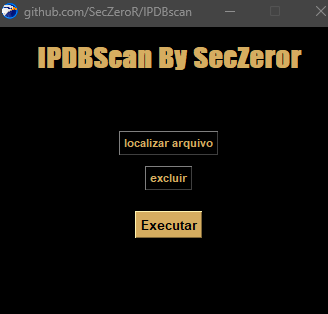
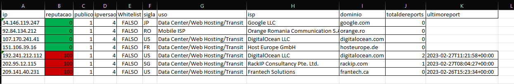

# IPDBscan

<p align="center">
  

<b>Essa ferramenta permite consultar a reputação de vários IPs do AbuseIPDB em um curto período de tempo, conectando-se à API do AbuseIPDB, lendo a chave API do arquivo de configuração e gerando um relatório em formato Excel com os resultados da verificação, para a funcionar corretamente basta salvar os IPS em um arquivo.txt e executar no programa</b>

<p align="center">
  
</p>
<p align="center">
  
</p>
<p align="center">
<b>Instalação </b>
<p/>

```
git clone https://github.com/SecZeroR/IPDBscan

```
<p align="center">
<b>Utilização</b> </p>


```
Registre-se no site https://www.abuseipdb.com

Acesse o link https://www.abuseipdb.com/account/api e crie sua chave API

Insira a chave no arquivo API_KEY.ini

Abra o arquivo scan.exe 

```


