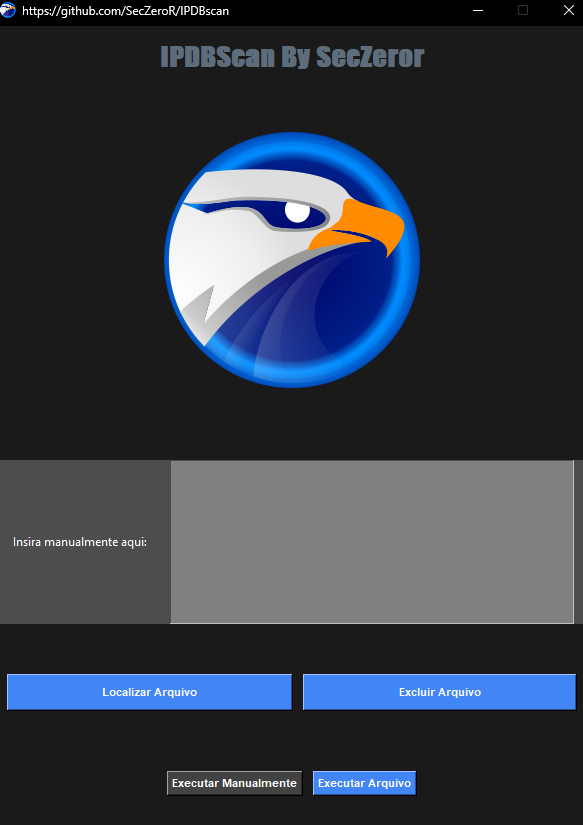

# IPDBscan


<b>Essa ferramenta permite consultar a reputação de vários IPs do AbuseIPDB em um curto período de tempo, conectando-se à API, lendo a chave do arquivo de configuração e gerando um relatório em formato Excel com os resultados da verificação, basta salvar os IPS em um arquivo  e executar no programa</b>


<p align="center">
  
</p>

<p align="center">

<p/>

# Versão 0.3

<a href="https://github.com/SecZeroR/IPDBscan/releases/download/ipdbscan0.3/IPDBscan0.3.zip">   Baixe Aqui </a></p>

<p align="center">
<b>Utilização</b> </p>


```
Certifique-se de ter a ultima versão do Python instalada no seu computador. https://www.python.org/downloads/

Registre-se no site https://www.abuseipdb.com

Acesse o link https://www.abuseipdb.com/account/api e crie sua chave API

Insira a chave no arquivo API_KEY.ini

Descompacte o arquivo IDBscan1.0.zip

Abra o arquivo scan.exe 

====== utilizando um arquivo ======

Clique em localizar arquivo e escolha o arquivo onde os ips estão armazenados

Clique em executar arquivo

Os resultados serão encontrados em um arquivo excel chamado resultados.xlsx na pasta da ferramenta.


====== Manualmente ======

copie e cole os IPS.

Clique em executar manualmente

Os resultados serão encontrados em um arquivo excel chamado resultados.xlsx na pasta da ferramenta.

```


